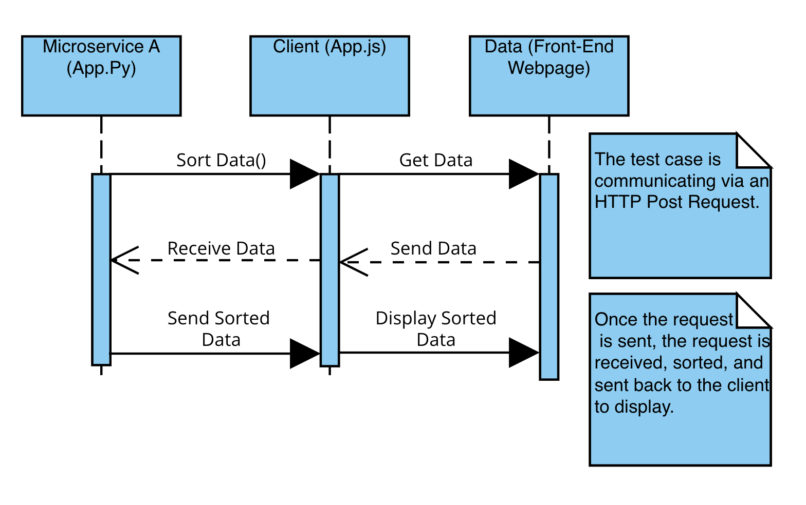

Taste City, an app built for Microservice communication.

This is the Taste City app, a restaurant recommendation service. 

Communication Contract: 

-How to programmatically REQUEST data:

To request data one could build an array like books = 

        {title: "Dune", date: "02-21-2025", order_number: 2 },{ title: "The Hobbit", date: "02-12-2025", order_number: 1 },
        { title: "Little Women", date: "02-19-2025", order_number:3}. 

Send the data to be sorted using the json format to an http post request to the local host 5527: 

        const response = await fetch('http://localhost:5527',{ method: "POST",headers: 
        { "Content-Type": "application/json" }, body: JSON.stringify({ type: "ALPHA", items: books.map(b => b.title) })});

-How to programmatically RECEIVE data: 

Receive the JSON data via the post request from the http localhost 57891. 

Sort the data and send it back using an http post request: 
        
        sorted_data = sorted(user_data, key=lambda x: x[sort_by])
        
        print("Sorting completed. Sending sorted data back to the client.")
        
        return jsonify({"status": "success", "data": sorted_data})

Result:          
        
        {"status": "success","data": ["Dune", "Little Women", "The Hobbit"]}

